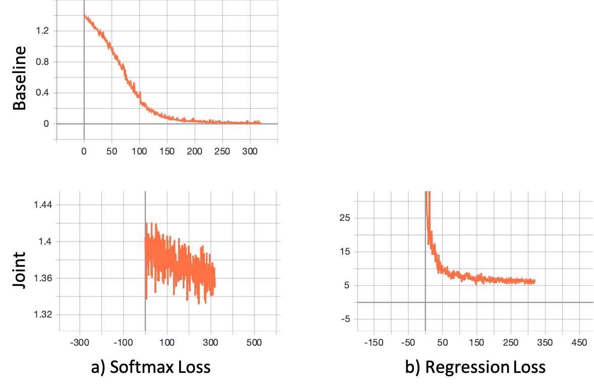

# GuitarChordRecognition
The goal of this project is to recognize the chord based on the input image.

### Dataset

Download the dataset from [here](https://drive.google.com/file/d/1yFsEPjK2KFCsKAWrG0-TMpdsKA-cnqMI/view?usp=sharing) and put it under the root project folder.

Create a `save` folder under the root project folder.

Below is the summary of our dataset.

| Chord | Total | Train | Validation | Test |
| :---: | :---: | :---: | :--------: | :--: |
|   C   |  60   |  40   |     10     |  10  |
|  Dm   |  60   |  40   |     10     |  10  |
|  Am   |  60   |  40   |     10     |  10  |
|   F   |  60   |  40   |     10     |  10  |
|  Hm   |  10   |   0   |     0      |  10  |

If you want to create more data with Amazon Turk, please use the html file `cmtKey.html`.

### Train

**Baseline**

A traditional classification model (resnet backbone + fc layer) to classify the images.

```python
python train.py --gpu --num_workers 0 --batch_size 32
```

**Joint Graph Model**

A graph-based finger localization model that can not only classify existing chords but can also recognize the unseen chords during test time.

First train the finger localization model with point annotations.

```python
python train_point.py --num_workers 0 --name point --dataset chord_point --middle point --decode point --batch_size 32
```

Then for each chord including the unseen ones, we select one corresponding image as its prototype that is stored in the database. Then for each input image, I compare the features extracted after GCN module with the features in database. Based on the similarity score, I retreieve the highest one. I call it metric-based recognization.

### Test

**Baseline**

Classification Accuracy

```shell
python test.py --num_workers 0
```

Metric-based Recognization Accuracy 

```shell
python test_metric.py --num_workers 0 --dataset chord_metric
```

**Joint Graph Model**

Classification Accuracy

```shell
python test_point.py --num_workers 0 --dataset chord_point --middle point --decode point --name point
```

Metric-based Recognization Accuracy 

```shell
python test_metric.py --num_workers 0 --dataset chord_metric --middle point --decode point --name point
```

### Result

**Softmax Classification with Seen chords**

|        Split        | Top-1 (%) | Top-2 (%) | Top-3 (%) |
| :-----------------: | :-------: | :-------: | :-------: |
| validation-Baseline |   72.5    |   85.0    |   97.5    |
|    test-Baseline    |   58.2    |   83.6    |   94.5    |
|  validation-Joint   |   35.0    |   57.5    |   77.5    |
|     test-Joint      |   23.6    |   43.6    |   69.1    |

**Metric-based Recognization Including Unseen Chords**

|  Model   | Top-1 Seen (%) | Top-2 Seen (%) | Top-1 Unseen (%) | Top-2 Unseen (%) |
| :------: | :------------: | :------------: | :--------------: | :--------------: |
| Baseline |      41.8      |      67.2      |       0.0        |      100.0       |
|  Joint   |      27.3      |      45.5      |       0.0        |       0.0        |

### Analysis

Unfortunately, the model with finger joints as annotations still has a poor performance. But I do find some clues.

Firstly, I think the main reason of the poor performance of the model is the additional loss function with finger position annotations. If I remove the loss function but keep the graph structure, the softmax classification result is actually not quite bad.

Second, the regression finger position loss seems to block the optimization of softmax loss (Finger Below). One possible reason is the current data size is not enough to optimize both bosses together. Therefore, if the model focuses more on the regresson loss, the classification accuracy drops a lot.



